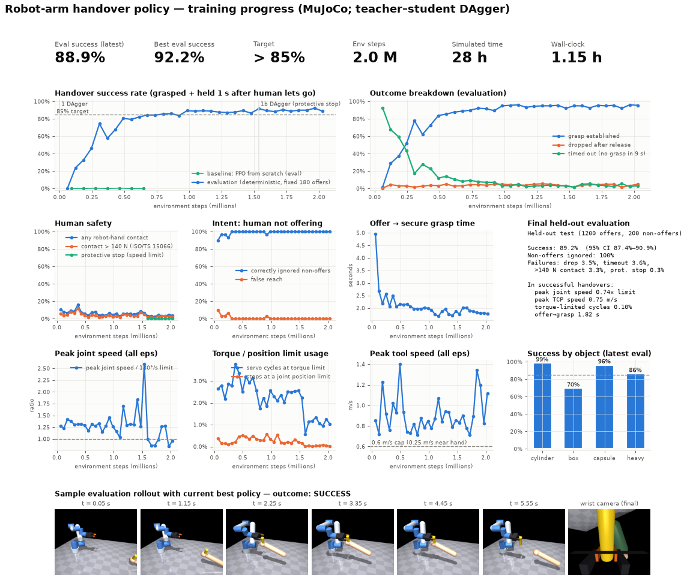
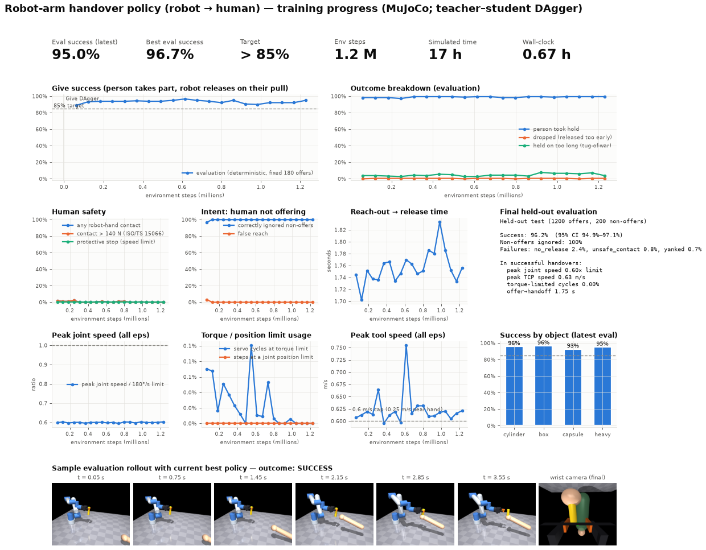

# Robot-arm handover: receiving parts from a human

A kinematic control policy for a collaborative robot arm. A human holds out a
component, and the policy decides when the offer is real, reaches for it,
grasps it, and holds it once the human lets go. It is trained in a MuJoCo
simulation that enforces physical limits, by teacher-student imitation
learning (DAgger).

## Result

**89.2 % handover success on a held-out test of 1,200 new offers** (95 % CI 87.4–90.9 %, target > 85 %).
The test seeds were never used in training or in model selection. All 200 non-offer episodes were
correctly ignored (0 false reaches).

| Metric (held-out, `reports/final_eval.json`) | Value |
|---|---|
| Handover success | **89.2 %** (CI 87.4–90.9 %) |
| Grasp established | 93.3 % |
| Dropped after human release | 3.5 % |
| Timed out (no grasp within 9 s) | 3.6 % |
| Hand contact > 140 N (counted as failure) | 3.3 % |
| Protective stop (speed limit exceeded) | 0.3 % |
| Any robot–hand contact | 4.9 % |
| Non-offers correctly ignored | 100 % |
| Success by object: cylinder / box / capsule / > 0.5 kg | 96 % / 75 % / 99 % / 89 % |
| Offer → secure grasp time (successful episodes) | 1.82 s |
| In successful handovers: peak joint speed / peak TCP speed / torque-limited servo cycles | 0.74 × limit / 0.75 m/s / 0.1 % |
| Contact with the human hand in successful handovers | 139 N peak |



**How it was trained.**
1. *PPO from scratch* (baseline) stayed near 0 % success after 0.7 M steps.
2. *DAgger*:
   * The teacher is a privileged scripted controller. It reads the true object pose and reaches 94–96 % success.
   * The student is the 256×256 MLP policy, which sees only noisy, delayed sensor observations.
   * The student's own rollouts were relabelled with teacher actions.
   * After about 1.5 M steps the student reached about 90 %.
   * It was then re-trained on the final environment, which adds the safety monitor, joint acceleration limits and table clearance.
3. *PPO fine-tuning* of the DAgger policy lowered success in the first 0.5 M steps (92 % → 80–84 %).
   It was stopped, and the DAgger policy (`models/handover_policy.pt`) is the deliverable.
   The logs are in `reports/logs/`.

**Known weaknesses.**
* Boxes succeed 75 % of the time. Wide, tilted boxes need precise yaw alignment of the gripper.
* In 3.3 % of offers the robot pressed on the hand above 140 N, and some successful handovers also
  came close to that limit.
* A deployment would need a force-limited approach mode, or wrist F/T-triggered stopping, close to the hand.

## Robot → human handover (giving parts)

The robot starts at home holding a part. When a person reaches out an open hand, it brings the part's free end
into their palm. It keeps holding while they close their grip, and lets go when the wrist F/T sensor feels them pull.

**Result on a held-out test: 96.2 % of 1,200 reach-outs succeeded** (95 % CI 94.9–97.1 %), and 100 % of 200
non-offer gestures were correctly ignored.
Policy: `models/give_policy.pt`; metrics: `reports/final_eval_give.json`.

| Metric (held-out) | Value |
|---|---|
| Give success (person walked away with the part, robot released it) | **96.2 %** |
| Person took hold of the part | 99.3 % |
| Dropped (released before the person had hold) | 0 % |
| Held on too long: person pulled for 1.2 s without release (tug-of-war) | 2.4 % |
| Part torn out of a still-closed gripper ("yanked") | 0.7 % |
| Hand contact > 140 N | 0.8 % |
| Non-offer gestures ignored | 100 % |
| Success: cylinder / box / capsule / > 0.5 kg | 96 % / 95 % / 97 % / 94 % |
| Pull onset → gripper released | 0.54 s (includes the 150 mm/s finger opening time) |
| In successful gives: robot–hand contact / peak joint speed / peak TCP speed | none / 0.60 × limit / 0.63 m/s |



**Human model for giving** (`handover/give_env.py`):
* The person reaches an open hand into the handover zone. In 20 % of episodes they shift it while waiting.
* They close their grip 0.2–0.4 s after the part's free end rests within 3.5 cm of their palm. The grip is a compliant weld.
* After a further 0.1–0.3 s they draw the part back 25 cm. They pull with a limited force of 15–35 N and wait,
  rather than yank harder, while the robot is still holding.
* If the robot hasn't let go after 1.2 s of pulling, the episode fails (tug-of-war).
* If the robot opens before the person has hold, the part falls and the episode fails.
* Negative controls are checked. A robot that never releases fails 100 % (no_release). One that releases on approach
  drops the part 100 %.

**Training.** Same teacher-student DAgger as the receive task: about 1.2 M simulation steps, 40 minutes on 4 CPU cores.
The privileged teacher knows when the pull starts. The student has to infer it from the wrist F/T reading.

Train: `python3 -m handover.dagger --task give --out runs/give_dagger --iters 200 --eval_every 10`
Evaluate: `python3 -m handover.final_eval models/give_policy.pt --task give`

## 1. Arm structure

| Item | Choice | Why |
|---|---|---|
| Kinematics | 6-DOF, UR5e-class geometry (shoulder 0.163 m, upper arm 0.425 m, forearm 0.392 m, spherical-ish wrist 0.133/0.100/0.100 m) | 6 DOF gives full position and orientation control of the gripper. That matters because a human presents parts at arbitrary tilt and yaw. 850 mm of reach covers a seated or standing handover zone from a table mount. |
| Mass and inertia | Link masses 3.7 / 8.4 / 2.3 / 1.2 / 1.2 / 0.19 kg, with realistic inertia tensors | Lightweight links keep the kinetic energy low if the arm hits someone. |
| Actuation | Torque-limited joint servos: 150 Nm (base, shoulder, elbow) and 28 Nm (wrist); 180 °/s joint speed limit; rotor armature, joint damping and Coulomb friction modelled | These are the limits of a real 5 kg-payload cobot drive train. |
| Joint ranges | Base ±180°, shoulder [-180°, 0°], elbow ±160°, wrists ±180° | Restricted from ±360° to prevent cable wrap and elbow self-collision, as in a cobot safety configuration. |
| Control stack | Policy at 20 Hz sends a Cartesian TCP twist and a gripper open/close command. Then: safety layer → damped-least-squares IK → joint servo at 500 Hz with gravity compensation and velocity feed-forward, saturated at the torque limits | A Cartesian action space is much easier to learn than joint torques. It also makes the safety limits easy to enforce independently of the network. |
| Mount | Table-top, with the human standing across the table about 1.1–1.3 m from the base | Typical layout for a workbench handover cell. |

## 2. Peripherals

| Peripheral | Model in sim | Purpose |
|---|---|---|
| **External RGB-D / stereo camera** (e.g. RealSense D435 / ZED 2), overhead behind the robot | Object and hand pose with 3 mm noise, ±4 mm per-episode calibration bias, 50–100 ms pipeline latency, 3 % frame drop-outs | Detects and tracks the human hand and the offered object. It is also what lets the policy tell an offer (approach, then hold still) apart from other motion. |
| **Wrist RGB-D camera** (e.g. RealSense D405, short range) | Takes over when the gripper is within 15 cm of the object: 1.5 mm noise, no calibration bias | Final-approach precision. The external camera is often occluded by the arm at that point. |
| **6-axis force/torque sensor** at the flange (e.g. Robotiq FT-300 / ATI Axia80) | Simulated F/T at the flange, tared at start, with noise | Feels the human letting go (load transfer). It is also used for collision detection and for robot-to-human release ("release when tugged"). |
| **Parallel-jaw gripper**, Robotiq 2F-85 class | 85 mm stroke, 150 mm/s closing speed, 30–60 N force limit per finger (randomised), high-friction pads with torsional friction | Grips a wide range of part sizes. Force limiting is required for human-collaborative use. |
| **Finger-pad tactile / contact sensors** | Touch sensors on both pads | Confirms that a grasp has formed before the robot asks the human to let go. |
| **Safety-rated monitoring** (SSM via the scene camera, protective stop) | TCP speed capped at 0.6 m/s, and at 0.25 m/s within 25 cm of the human hand (ISO 10218 / ISO/TS 15066). Accel limits 4 m/s² and 12 rad/s². Hand-contact force above 140 N counts as a failure | Keeps the robot within collaborative-operation limits during contact. |

## 3. Simulation and physical constraints

* A safety monitor at 100 Hz triggers a protective stop, which counts as a failure, if any joint exceeds 180 °/s
  or the TCP exceeds 1.0 m/s. Commanded joint speed is capped at 85 % of the limit and joint acceleration at 8 rad/s².
* MuJoCo 3 rigid-body dynamics at a 2 ms step (500 Hz servo). Contacts use an elliptic friction cone
  and torsional friction at the pads.
* Joint position, velocity and torque limits are enforced at the right level:
  torque saturation in the actuator, velocity and position limits in the IK layer, and hard joint limits in the physics.
* Gravity compensation is routed through the actuators, so it counts toward the torque limits.
* The human hand is a kinematic body that holds the object through a compliant weld constraint. The human
  lets go 0.15–0.35 s after the robot's grip is established (both pads in contact and grip force above 5 N), then
  pulls the hand back.
* Domain randomisation:
  * Objects: cylinder, box or capsule; 24–68 mm wide, 130–220 mm long, 50–800 g, friction 0.5–1.0.
  * Offer: tilted up to 30° at any yaw; offer location within a 0.26 × 0.6 × 0.37 m zone.
  * Human behaviour: approach time 0.8–1.6 s, start delay, drift and tremor, and in 20 % of offers a re-adjustment of the offer.
  * Sensors: noise, latency and calibration bias as described in section 2.
  * Gripper force.
* About 15 % of training episodes are **distractors**: the human waves the part through the workspace, or handles it
  near their own body, without offering it. Here the robot must not reach. This measures whether it *detects* that
  something is being handed to it.

## 4. Success metric

An offer is a **success** when the robot has grasped the object, the human has let go, and the robot keeps holding
the object securely for 1 s. Securely means:
* both pads are still in contact;
* the object is not touching the table;
* the object is within 8 cm of the TCP.

It is a failure if any of the following happens:
* the object is dropped;
* nothing has been grasped within 9 s;
* the robot contacts the human hand with more than 140 N.

Other metrics are tracked during training and evaluation:
* grasp, drop, timeout and unsafe-contact rates;
* hand-contact rate;
* distractor rejection and false-reach rate;
* time from offer to grasp;
* peak TCP speed, peak joint speed relative to the motor limit, torque-saturation fraction, and joint-limit usage;
* success by object type and for heavy objects.

## 5. Code

```
handover/model.py     MJCF model of the cell (arm, gripper, sensors, human, objects)
handover/env.py       Receive (human→robot) env + shared control stack, sensor models, safety monitor, metrics
handover/give_env.py  Give (robot→human) env: force-limited human pull model, release-on-pull task
handover/ppo.py       PPO trainer with multiprocess vectorised envs, periodic deterministic evaluation
handover/scripted.py  Privileged scripted controller (DAgger teacher; reads true state)
handover/dagger.py    Teacher-student imitation (DAgger) trainer
handover/final_eval.py  Held-out evaluation with Wilson confidence interval
models/handover_policy.pt  Final policy (actor/critic weights + observation normaliser)
handover/report.py    Progress dashboard (multi-metric curves + rendered rollout filmstrip)
```

Train: `python3 -m handover.dagger --out runs/dagger --iters 250 --eval_every 10`
(optional fine-tune: `python3 -m handover.ppo --out runs/ppo_ft --init_from <ckpt> --critic_warmup 25`)
Evaluate: `python3 -m handover.final_eval models/handover_policy.pt`
Report: `MUJOCO_GL=osmesa python3 -m handover.report --run runs/ppo_a --out reports/progress.png`
